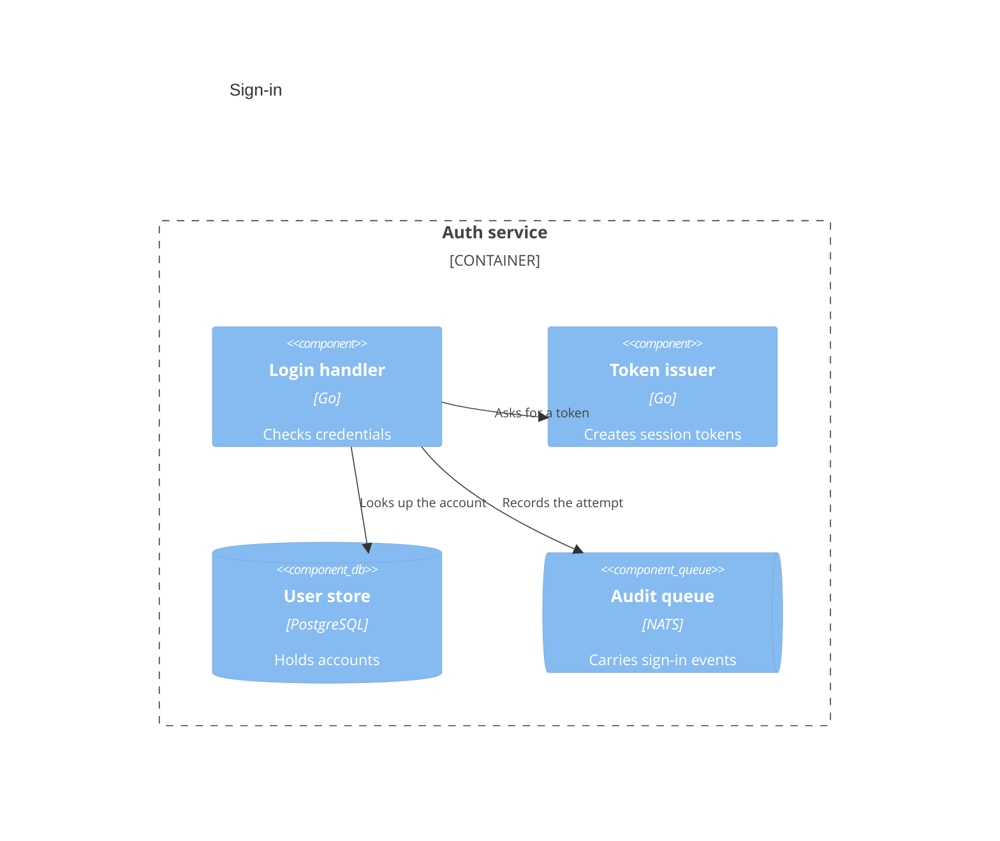

# Auth components

```mermaid
C4Component
  title Sign-in
  Container_Boundary(auth, "Auth service") {
    Component(login, "Login handler", "Go", "Checks credentials")
    Component(tokens, "Token issuer", "Go", "Creates session tokens")
    ComponentDb(users, "User store", "PostgreSQL", "Holds accounts")
    ComponentQueue(audit, "Audit queue", "NATS", "Carries sign-in events")
  }
  Rel(login, users, "Looks up the account")
  Rel(login, tokens, "Asks for a token")
  Rel(login, audit, "Records the attempt")
```
