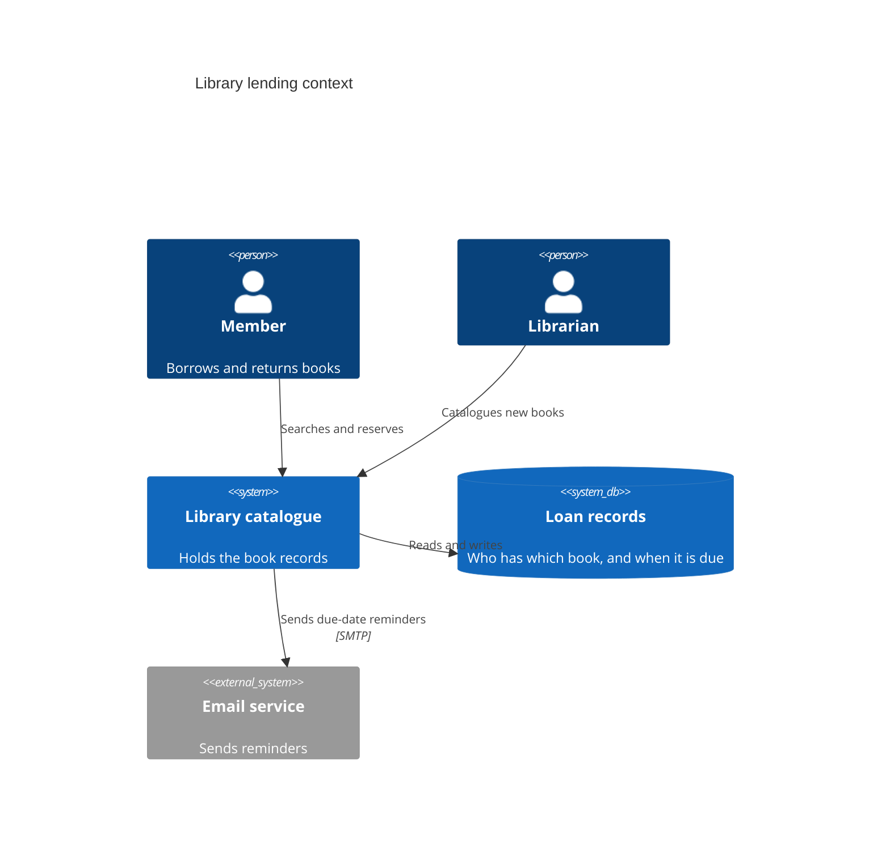

# Library context

```mermaid
C4Context
  title Library lending context
  Person(member, "Member", "Borrows and returns books")
  Person(librarian, "Librarian")
  System(catalogue, "Library catalogue", "Holds the book records")
  SystemDb(loans, "Loan records", "Who has which book, and when it is due")
  System_Ext(email, "Email service", "Sends reminders")
  Rel(member, catalogue, "Searches and reserves")
  Rel(librarian, catalogue, "Catalogues new books")
  Rel(catalogue, loans, "Reads and writes")
  Rel(catalogue, email, "Sends due-date reminders", "SMTP")
```
