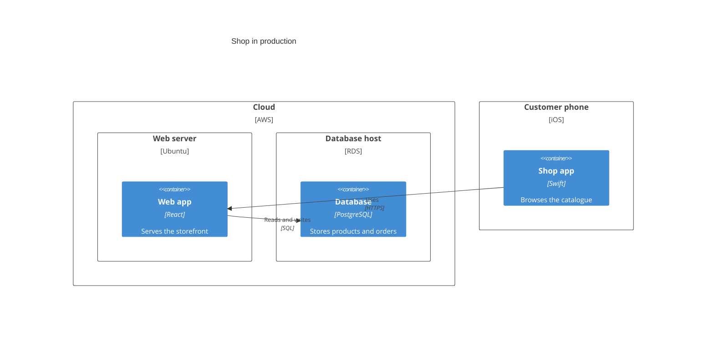

# Shop deployment

```mermaid
C4Deployment
  title Shop in production
  Deployment_Node(cloud, "Cloud", "AWS") {
    Deployment_Node(vm, "Web server", "Ubuntu") {
      Container(web, "Web app", "React", "Serves the storefront")
    }
    Deployment_Node(dbhost, "Database host", "RDS") {
      Container(db, "Database", "PostgreSQL", "Stores products and orders")
    }
  }
  Deployment_Node(phone, "Customer phone", "iOS") {
    Container(shopapp, "Shop app", "Swift", "Browses the catalogue")
  }
  Rel(shopapp, web, "Uses", "HTTPS")
  Rel(web, db, "Reads and writes", "SQL")
```
