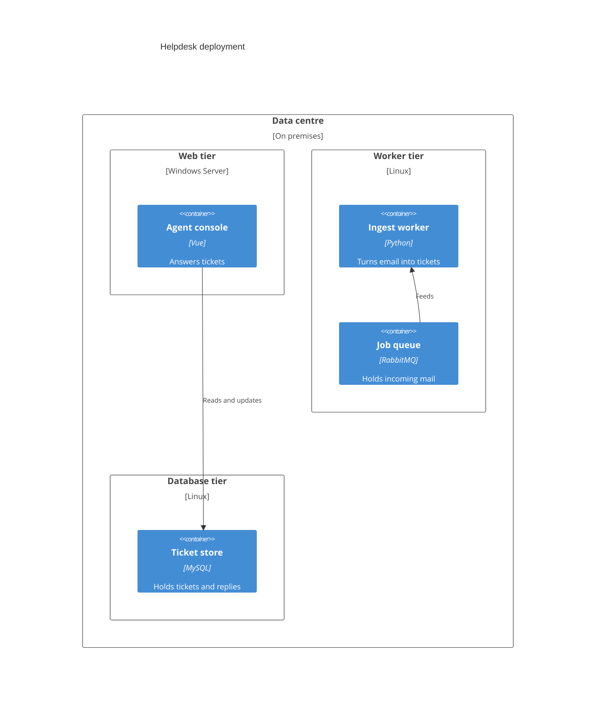

# Ticketing deployment

```mermaid
C4Deployment
  title Helpdesk deployment
  Deployment_Node(dc, "Data centre", "On premises") {
    Deployment_Node(webtier, "Web tier", "Windows Server") {
      Container(console, "Agent console", "Vue", "Answers tickets")
    }
    Deployment_Node(workers, "Worker tier", "Linux") {
      Container(ingest, "Ingest worker", "Python", "Turns email into tickets")
      Container(jobs, "Job queue", "RabbitMQ", "Holds incoming mail")
    }
    Deployment_Node(dbtier, "Database tier", "Linux") {
      Container(tickets, "Ticket store", "MySQL", "Holds tickets and replies")
    }
  }
  Rel(console, tickets, "Reads and updates")
  Rel(jobs, ingest, "Feeds")
```
