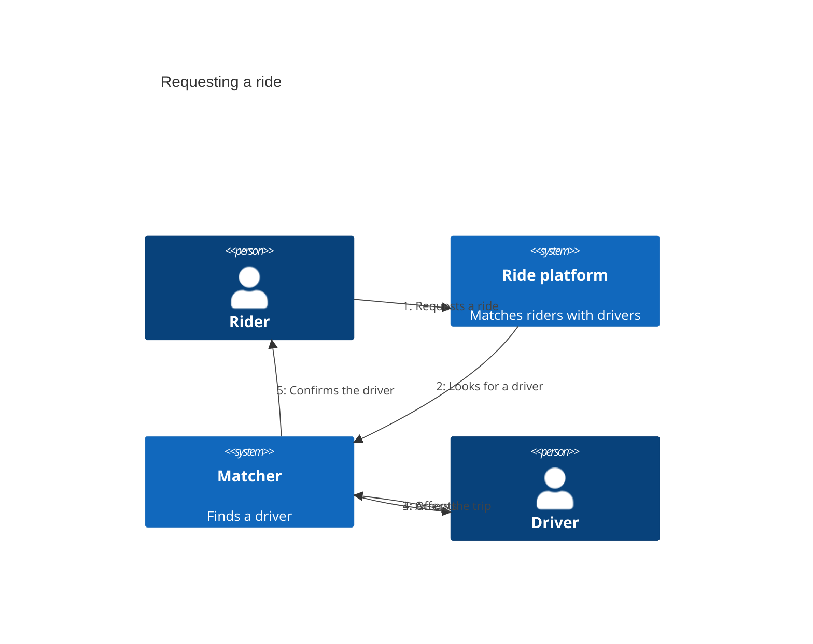

# Ride request

```mermaid
C4Dynamic
  title Requesting a ride
  Person(rider, "Rider")
  System(platform, "Ride platform", "Matches riders with drivers")
  System(matcher, "Matcher", "Finds a driver")
  Person(driver, "Driver")
  RelIndex(1, rider, platform, "Requests a ride")
  RelIndex(2, platform, matcher, "Looks for a driver")
  RelIndex(3, matcher, driver, "Offers the trip")
  RelIndex(4, driver, matcher, "Accepts")
  RelIndex(5, matcher, rider, "Confirms the driver")
```
