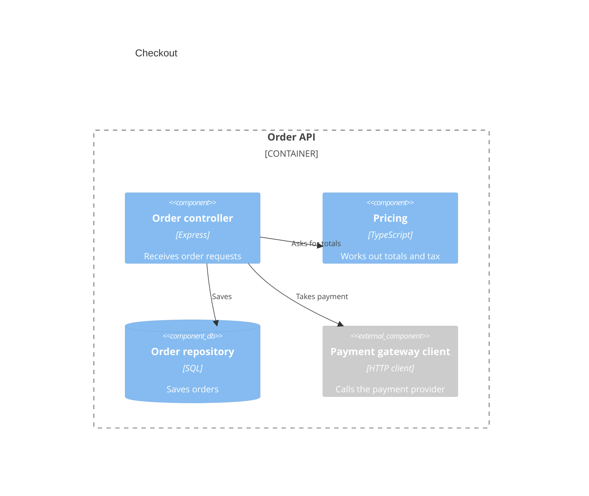

# Checkout components

```mermaid
C4Component
UpdateLayoutConfig($c4ShapeInRow="3", $c4BoundaryInRow="1")
  title Checkout
  Container_Boundary(api, "Order API") {
    Component(controller, "Order controller", "Express", "Receives order requests")
    Component(pricing, "Pricing", "TypeScript", "Works out totals and tax")
    ComponentDb(orders, "Order repository", "SQL", "Saves orders")
    Component_Ext(gateway, "Payment gateway client", "HTTP client", "Calls the payment provider")
  }
  Rel(controller, pricing, "Asks for totals")
  Rel(controller, orders, "Saves")
  Rel(controller, gateway, "Takes payment")
```
