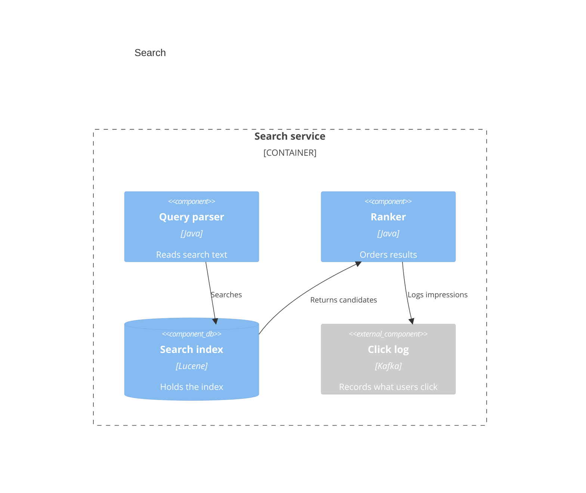

# Search components

```mermaid
C4Component
UpdateLayoutConfig($c4ShapeInRow="3", $c4BoundaryInRow="1")
  title Search
  Container_Boundary(search, "Search service") {
    Component(query, "Query parser", "Java", "Reads search text")
    Component(ranker, "Ranker", "Java", "Orders results")
    ComponentDb(index, "Search index", "Lucene", "Holds the index")
    Component_Ext(clicks, "Click log", "Kafka", "Records what users click")
  }
  Rel(query, index, "Searches")
  Rel(index, ranker, "Returns candidates")
  Rel(ranker, clicks, "Logs impressions")
```
