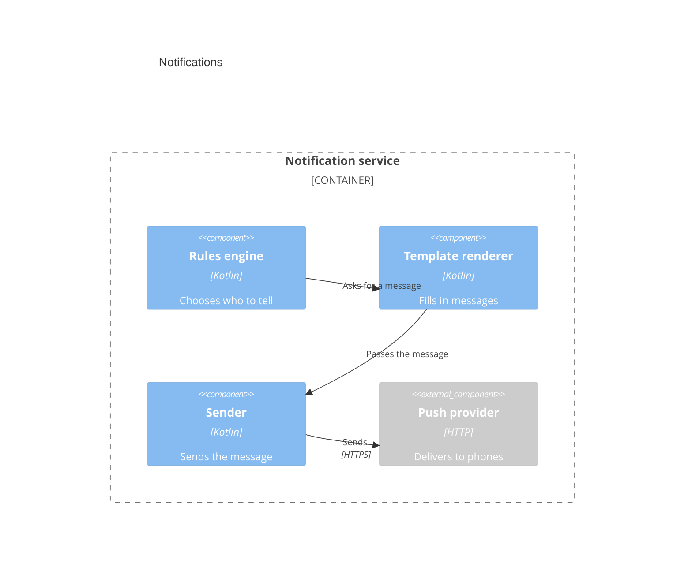

# Notifications components

```mermaid
C4Component
UpdateLayoutConfig($c4ShapeInRow="3", $c4BoundaryInRow="1")
  title Notifications
  Container_Boundary(notify, "Notification service") {
    Component(rules, "Rules engine", "Kotlin", "Chooses who to tell")
    Component(render, "Template renderer", "Kotlin", "Fills in messages")
    Component(sender, "Sender", "Kotlin", "Sends the message")
    Component_Ext(push, "Push provider", "HTTP", "Delivers to phones")
  }
  Rel(rules, render, "Asks for a message")
  Rel(render, sender, "Passes the message")
  Rel(sender, push, "Sends", "HTTPS")
```
