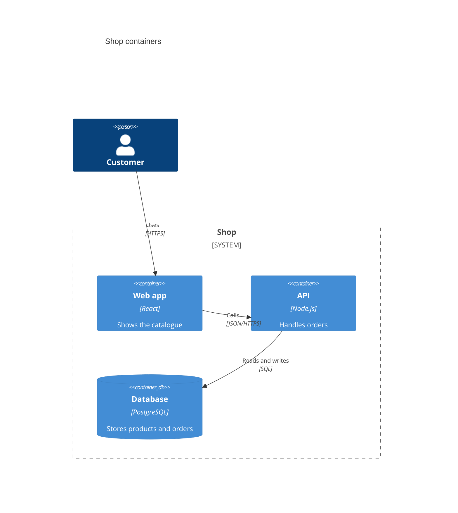

# Shop containers

```mermaid
C4Container
UpdateLayoutConfig($c4ShapeInRow="3", $c4BoundaryInRow="1")
  title Shop containers
  Person(customer, "Customer")
  System_Boundary(shop, "Shop") {
    Container(web, "Web app", "React", "Shows the catalogue")
    Container(api, "API", "Node.js", "Handles orders")
    ContainerDb(db, "Database", "PostgreSQL", "Stores products and orders")
  }
  Rel(customer, web, "Uses", "HTTPS")
  Rel(web, api, "Calls", "JSON/HTTPS")
  Rel(api, db, "Reads and writes", "SQL")
```
