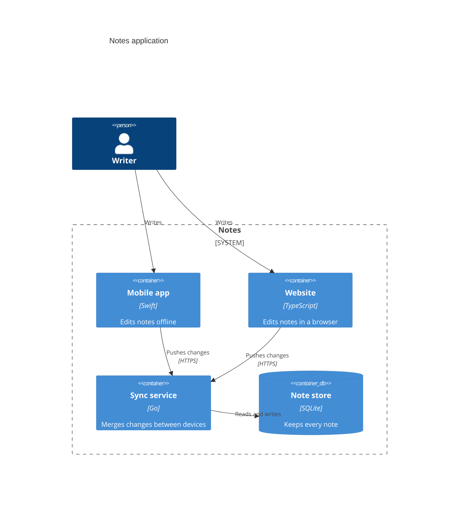

# Notes app containers

```mermaid
C4Container
UpdateLayoutConfig($c4ShapeInRow="3", $c4BoundaryInRow="1")
  title Notes application
  Person(user, "Writer")
  System_Boundary(notes, "Notes") {
    Container(mobile, "Mobile app", "Swift", "Edits notes offline")
    Container(site, "Website", "TypeScript", "Edits notes in a browser")
    Container(sync, "Sync service", "Go", "Merges changes between devices")
    ContainerDb(store, "Note store", "SQLite", "Keeps every note")
  }
  Rel(user, mobile, "Writes")
  Rel(user, site, "Writes")
  Rel(mobile, sync, "Pushes changes", "HTTPS")
  Rel(site, sync, "Pushes changes", "HTTPS")
  Rel(sync, store, "Reads and writes")
```
