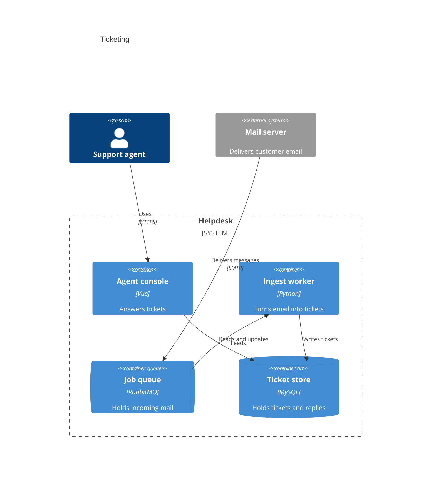

# Ticketing containers

```mermaid
C4Container
UpdateLayoutConfig($c4ShapeInRow="3", $c4BoundaryInRow="1")
  title Ticketing
  Person(agent, "Support agent")
  System_Ext(mail, "Mail server", "Delivers customer email")
  System_Boundary(desk, "Helpdesk") {
    Container(console, "Agent console", "Vue", "Answers tickets")
    Container(ingest, "Ingest worker", "Python", "Turns email into tickets")
    ContainerQueue(jobs, "Job queue", "RabbitMQ", "Holds incoming mail")
    ContainerDb(tickets, "Ticket store", "MySQL", "Holds tickets and replies")
  }
  Rel(agent, console, "Uses", "HTTPS")
  Rel(mail, jobs, "Delivers messages", "SMTP")
  Rel(jobs, ingest, "Feeds")
  Rel(ingest, tickets, "Writes tickets")
  Rel(console, tickets, "Reads and updates")
```
