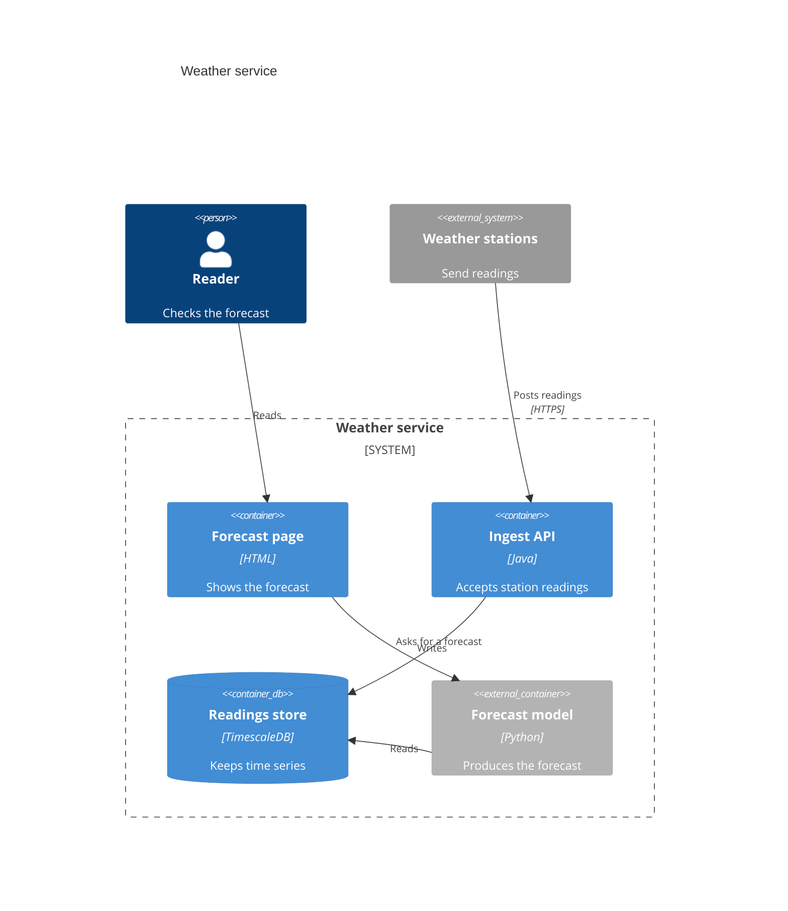

# Weather containers

```mermaid
C4Container
UpdateLayoutConfig($c4ShapeInRow="3", $c4BoundaryInRow="1")
  title Weather service
  Person(reader, "Reader", "Checks the forecast")
  System_Ext(sensors, "Weather stations", "Send readings")
  System_Boundary(weather, "Weather service") {
    Container(page, "Forecast page", "HTML", "Shows the forecast")
    Container(feed, "Ingest API", "Java", "Accepts station readings")
    ContainerDb(readings, "Readings store", "TimescaleDB", "Keeps time series")
    Container_Ext(model, "Forecast model", "Python", "Produces the forecast")
  }
  Rel(reader, page, "Reads")
  Rel(sensors, feed, "Posts readings", "HTTPS")
  Rel(feed, readings, "Writes")
  Rel(model, readings, "Reads")
  Rel(page, model, "Asks for a forecast")
```
