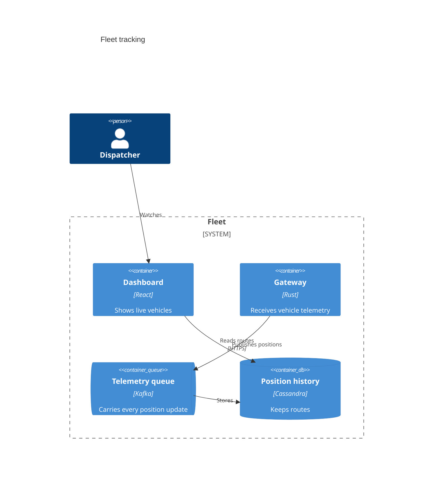

# Fleet containers

```mermaid
C4Container
UpdateLayoutConfig($c4ShapeInRow="3", $c4BoundaryInRow="1")
  title Fleet tracking
  Person(dispatcher, "Dispatcher")
  System_Boundary(fleet, "Fleet") {
    Container(dashboard, "Dashboard", "React", "Shows live vehicles")
    Container(gateway, "Gateway", "Rust", "Receives vehicle telemetry")
    ContainerQueue(telemetry, "Telemetry queue", "Kafka", "Carries every position update")
    ContainerDb(history, "Position history", "Cassandra", "Keeps routes")
  }
  Rel(dispatcher, dashboard, "Watches")
  Rel(gateway, telemetry, "Publishes positions")
  Rel(telemetry, history, "Stores")
  Rel(dashboard, history, "Reads routes", "HTTPS")
```
