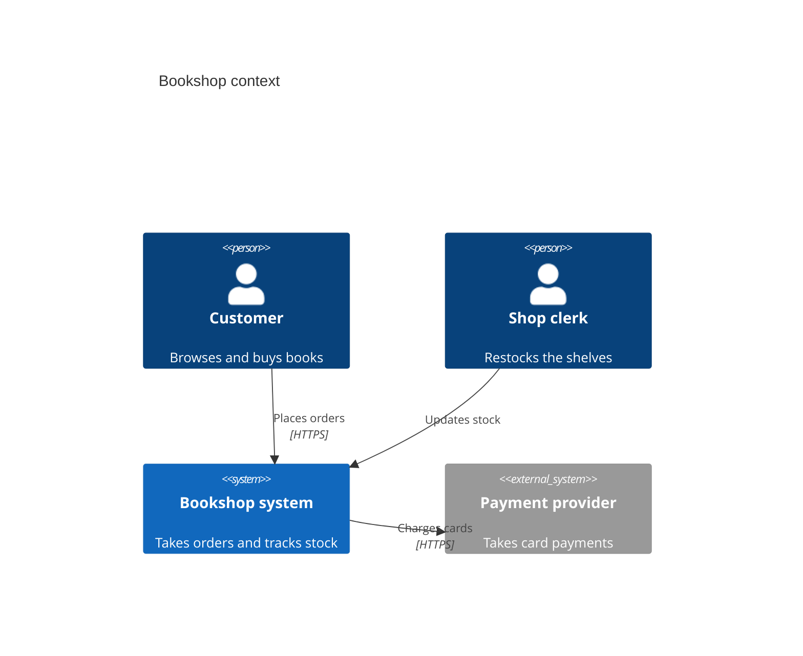

# Bookshop context

```mermaid
C4Context
UpdateLayoutConfig($c4ShapeInRow="3", $c4BoundaryInRow="1")
  title Bookshop context
  Person(customer, "Customer", "Browses and buys books")
  Person(clerk, "Shop clerk", "Restocks the shelves")
  System(shop, "Bookshop system", "Takes orders and tracks stock")
  System_Ext(payments, "Payment provider", "Takes card payments")
  Rel(customer, shop, "Places orders", "HTTPS")
  Rel(clerk, shop, "Updates stock")
  Rel(shop, payments, "Charges cards", "HTTPS")
```
