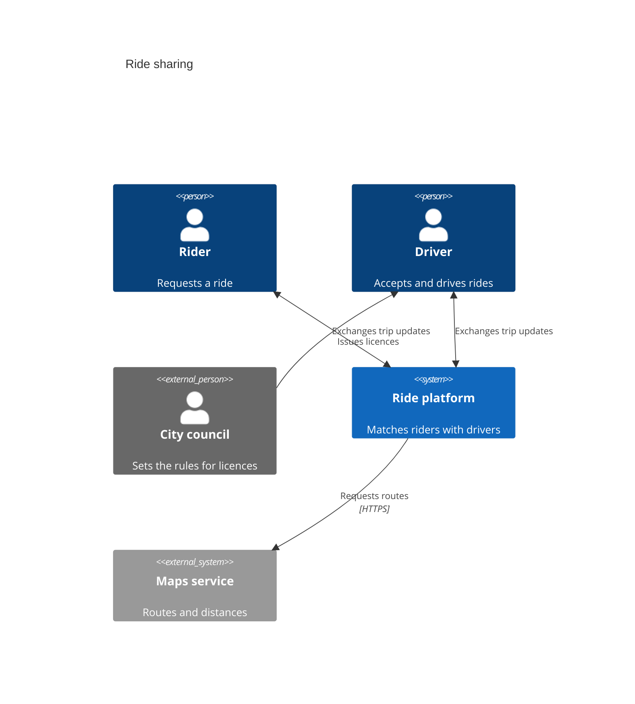

# Ride sharing context

```mermaid
C4Context
UpdateLayoutConfig($c4ShapeInRow="3", $c4BoundaryInRow="1")
  title Ride sharing
  Person(rider, "Rider", "Requests a ride")
  Person(driver, "Driver", "Accepts and drives rides")
  Person_Ext(city, "City council", "Sets the rules for licences")
  System(rides, "Ride platform", "Matches riders with drivers")
  System_Ext(maps, "Maps service", "Routes and distances")
  BiRel(rider, rides, "Exchanges trip updates")
  BiRel(driver, rides, "Exchanges trip updates")
  Rel(rides, maps, "Requests routes", "HTTPS")
  Rel(city, driver, "Issues licences")
```
