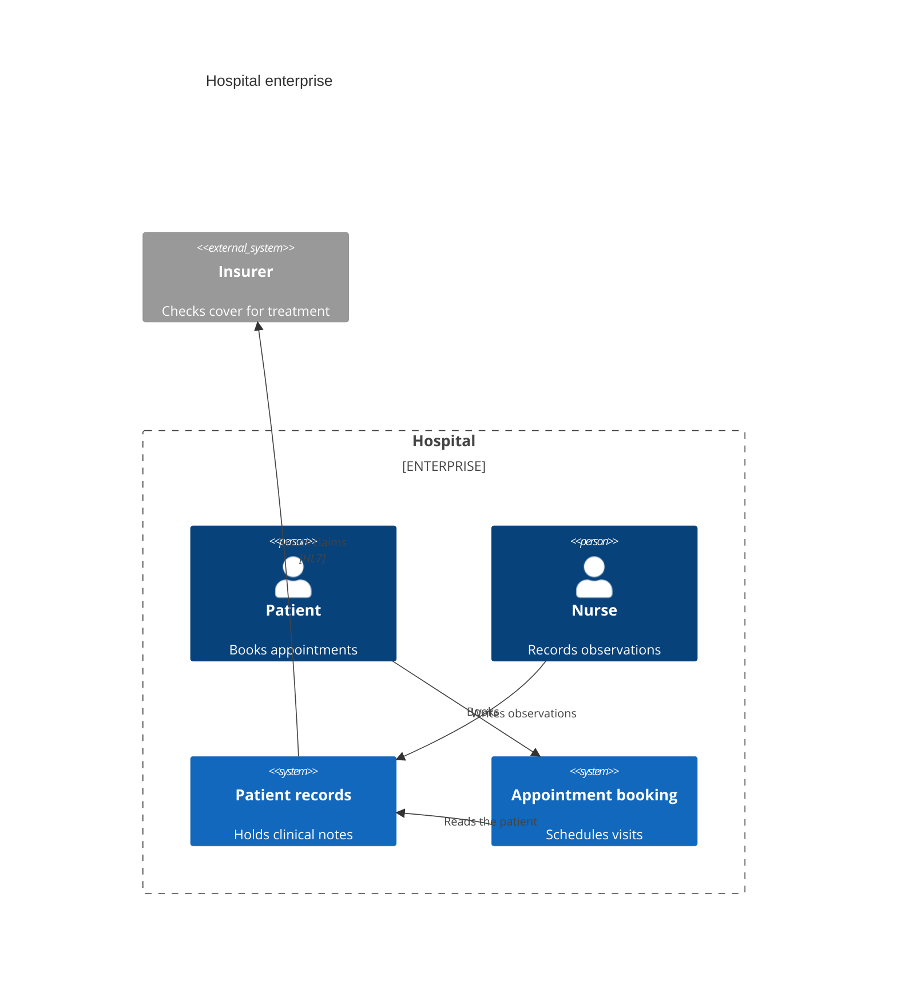

# Hospital enterprise context

```mermaid
C4Context
UpdateLayoutConfig($c4ShapeInRow="3", $c4BoundaryInRow="1")
  title Hospital enterprise
  Enterprise_Boundary(hospital, "Hospital") {
    Person(patient, "Patient", "Books appointments")
    Person(nurse, "Nurse", "Records observations")
    System(records, "Patient records", "Holds clinical notes")
    System(booking, "Appointment booking", "Schedules visits")
  }
  System_Ext(insurer, "Insurer", "Checks cover for treatment")
  Rel(patient, booking, "Books")
  Rel(nurse, records, "Writes observations")
  Rel(booking, records, "Reads the patient")
  Rel(records, insurer, "Sends claims", "HL7")
```
