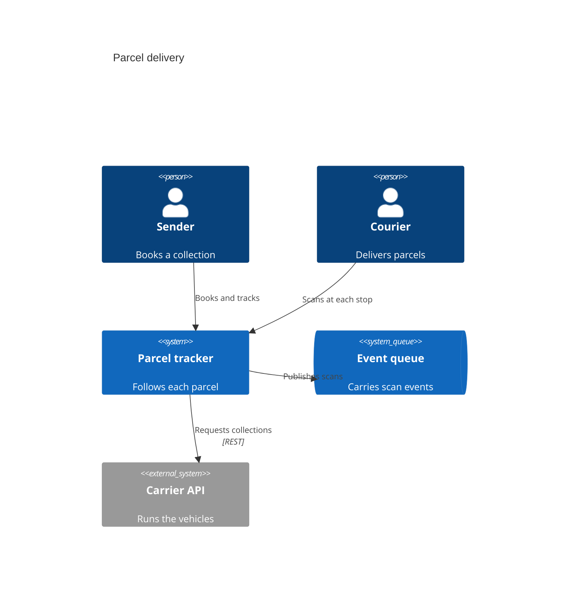

# Parcel context

```mermaid
C4Context
UpdateLayoutConfig($c4ShapeInRow="3", $c4BoundaryInRow="1")
  title Parcel delivery
  Person(sender, "Sender", "Books a collection")
  Person(courier, "Courier", "Delivers parcels")
  System(parcels, "Parcel tracker", "Follows each parcel")
  SystemQueue(events, "Event queue", "Carries scan events")
  System_Ext(carrier, "Carrier API", "Runs the vehicles")
  Rel(sender, parcels, "Books and tracks")
  Rel(courier, parcels, "Scans at each stop")
  Rel(parcels, events, "Publishes scans")
  Rel(parcels, carrier, "Requests collections", "REST")
```
