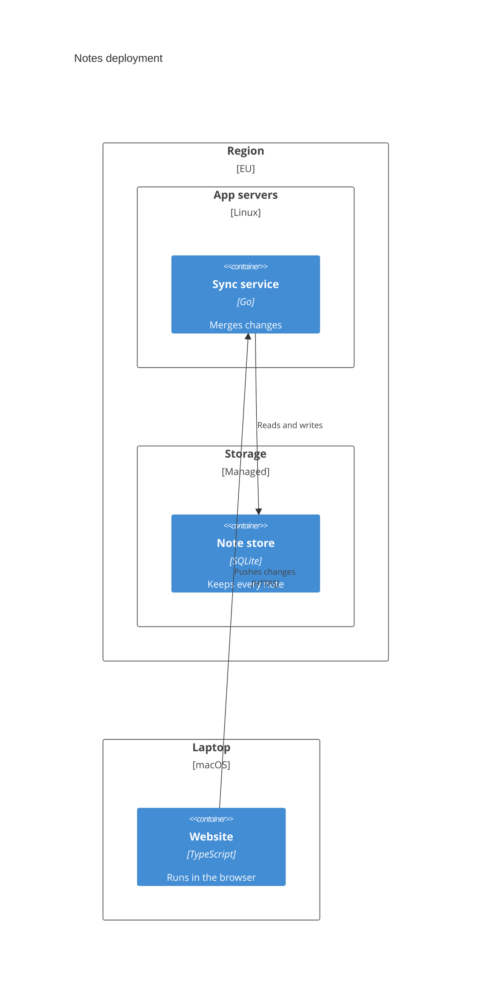

# Notes deployment

```mermaid
C4Deployment
UpdateLayoutConfig($c4ShapeInRow="3", $c4BoundaryInRow="1")
  title Notes deployment
  Deployment_Node(region, "Region", "EU") {
    Deployment_Node(app, "App servers", "Linux") {
      Container(sync, "Sync service", "Go", "Merges changes")
    }
    Deployment_Node(store, "Storage", "Managed") {
      Container(notes, "Note store", "SQLite", "Keeps every note")
    }
  }
  Deployment_Node(laptop, "Laptop", "macOS") {
    Container(site, "Website", "TypeScript", "Runs in the browser")
  }
  Rel(site, sync, "Pushes changes", "HTTPS")
  Rel(sync, notes, "Reads and writes")
```
