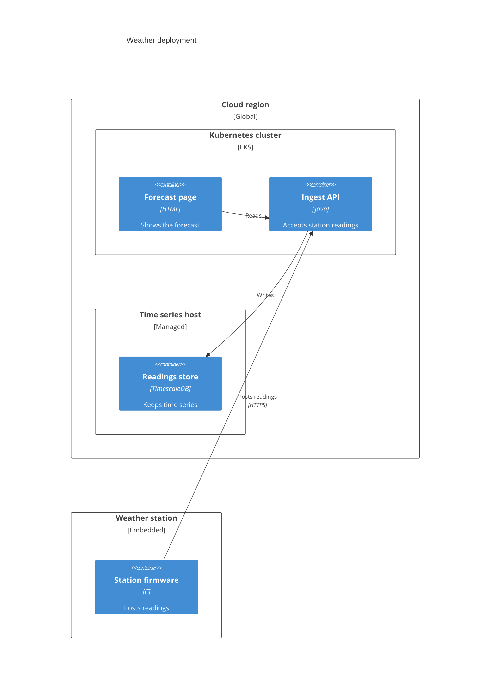

# Weather deployment

```mermaid
C4Deployment
UpdateLayoutConfig($c4ShapeInRow="3", $c4BoundaryInRow="1")
  title Weather deployment
  Deployment_Node(cloud, "Cloud region", "Global") {
    Deployment_Node(cluster, "Kubernetes cluster", "EKS") {
      Container(page, "Forecast page", "HTML", "Shows the forecast")
      Container(feed, "Ingest API", "Java", "Accepts station readings")
    }
    Deployment_Node(tsdb, "Time series host", "Managed") {
      Container(readings, "Readings store", "TimescaleDB", "Keeps time series")
    }
  }
  Deployment_Node(station, "Weather station", "Embedded") {
    Container(firmware, "Station firmware", "C", "Posts readings")
  }
  Rel(firmware, feed, "Posts readings", "HTTPS")
  Rel(feed, readings, "Writes")
  Rel(page, feed, "Reads")
```
