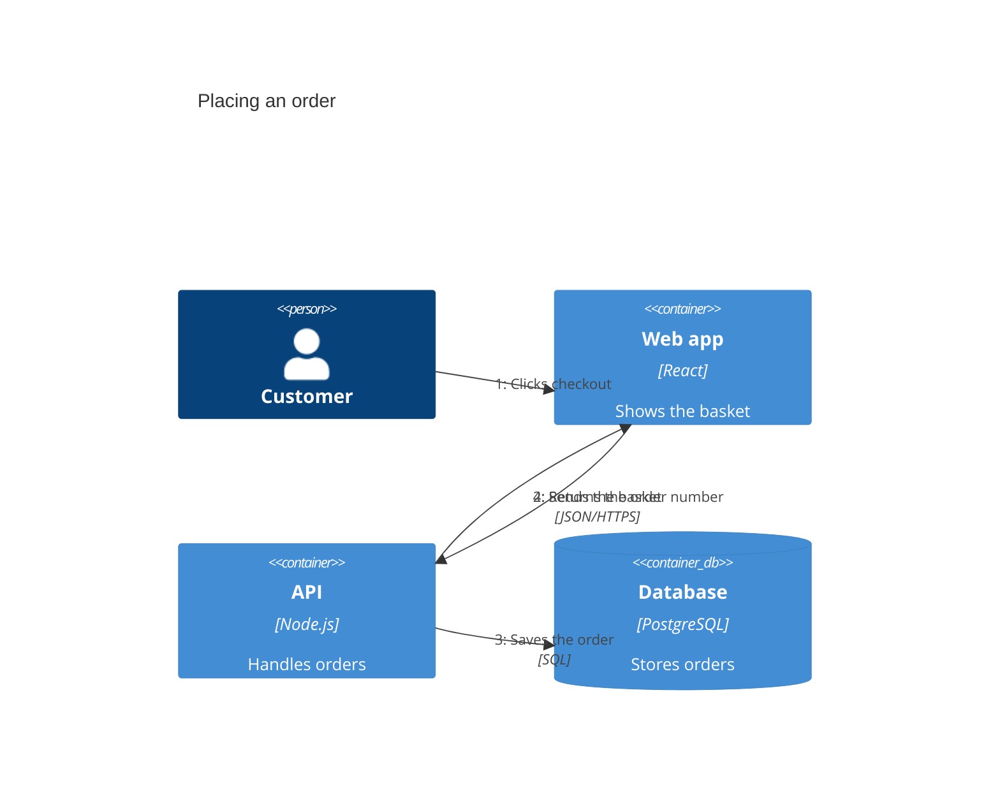

# Placing an order

```mermaid
C4Dynamic
UpdateLayoutConfig($c4ShapeInRow="3", $c4BoundaryInRow="1")
  title Placing an order
  Person(customer, "Customer")
  Container(web, "Web app", "React", "Shows the basket")
  Container(api, "API", "Node.js", "Handles orders")
  ContainerDb(db, "Database", "PostgreSQL", "Stores orders")
  RelIndex(1, customer, web, "Clicks checkout")
  RelIndex(2, web, api, "Sends the basket", "JSON/HTTPS")
  RelIndex(3, api, db, "Saves the order", "SQL")
  RelIndex(4, api, web, "Returns the order number")
```
