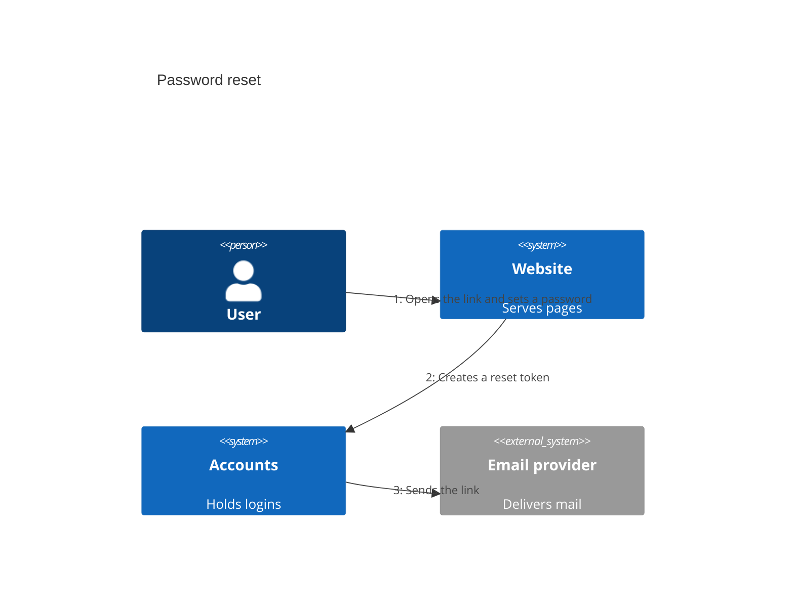

# Password reset

```mermaid
C4Dynamic
UpdateLayoutConfig($c4ShapeInRow="3", $c4BoundaryInRow="1")
  title Password reset
  Person(user, "User")
  System(site, "Website", "Serves pages")
  System(accounts, "Accounts", "Holds logins")
  System_Ext(mail, "Email provider", "Delivers mail")
  RelIndex(1, user, site, "Asks for a reset")
  RelIndex(2, site, accounts, "Creates a reset token")
  RelIndex(3, accounts, mail, "Sends the link")
  RelIndex(4, user, site, "Opens the link and sets a password")
```
