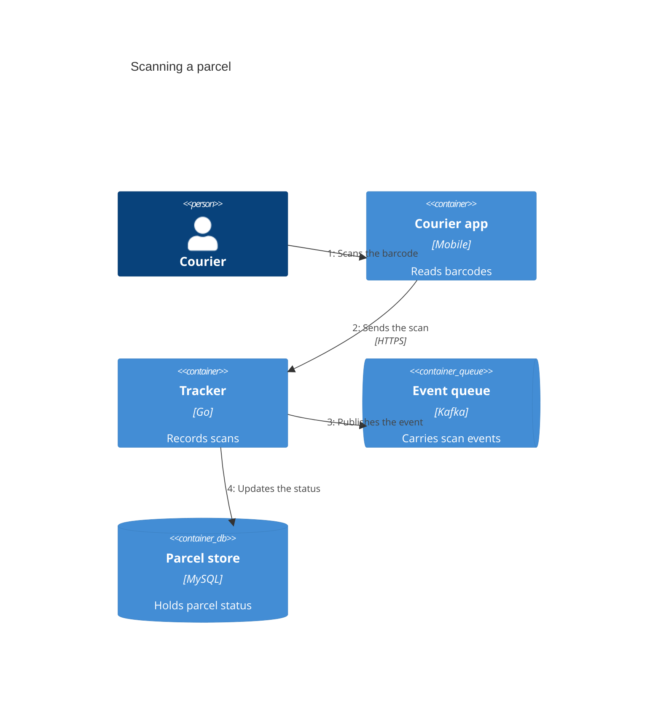

# Parcel scan

```mermaid
C4Dynamic
UpdateLayoutConfig($c4ShapeInRow="3", $c4BoundaryInRow="1")
  title Scanning a parcel
  Person(courier, "Courier")
  Container(app, "Courier app", "Mobile", "Reads barcodes")
  Container(tracker, "Tracker", "Go", "Records scans")
  ContainerQueue(events, "Event queue", "Kafka", "Carries scan events")
  ContainerDb(store, "Parcel store", "MySQL", "Holds parcel status")
  RelIndex(1, courier, app, "Scans the barcode")
  RelIndex(2, app, tracker, "Sends the scan", "HTTPS")
  RelIndex(3, tracker, events, "Publishes the event")
  RelIndex(4, tracker, store, "Updates the status")
```
