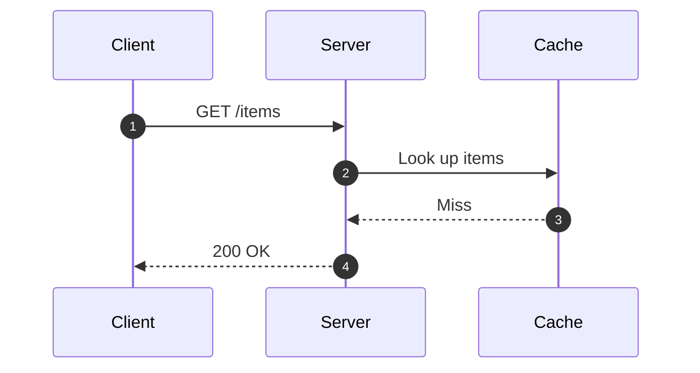

# Cached request

```mermaid
sequenceDiagram
autonumber
    participant Client
    participant Server
    participant Cache
    Client->>Server: GET /items
    Server->>Cache: Look up items
    Cache-->>Server: Miss
    Server-->>Client: 200 OK
```
